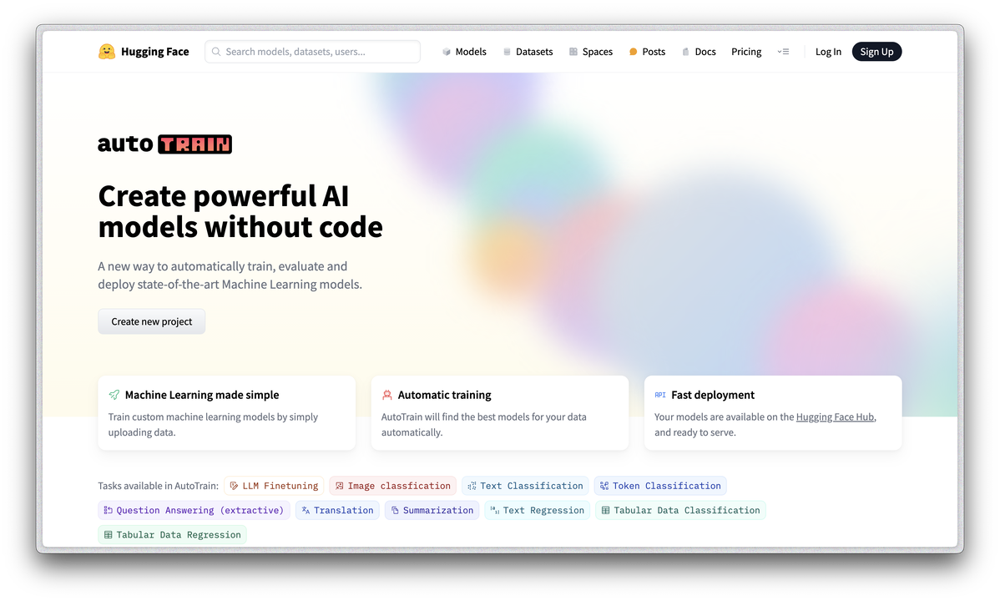

# Easiest Way to Fine-Tune LLMs Using AutoTrain

## Table of Contents
1. [Introduction](#introduction)
2. [Features](#features)
3. [Installation](#installation)
   - [Linux and Mac](#linux-and-mac)
   - [Windows](#windows)
4. [Usage](#usage)
   - [Command Line Interface](#command-line-interface)
   - [AutoTrain UI](#autotrain-ui)
5. [Fine-Tuning Methods](#fine-tuning-methods)
   - [Supervised Fine-Tuning (SFT)](#supervised-fine-tuning-sft)
   - [Odds Ratio Preference Optimization (ORPO)](#odds-ratio-preference-optimization-orpo)
   - [Direct Preference Optimization (DPO)](#direct-preference-optimization-dpo)
   - [Reinforcement Learning from Human Feedback (RLHF)](#reinforcement-learning-from-human-feedback-rlhf)
6. [Dataset Preparation](#dataset-preparation)
7. [Examples](#examples)
8. [Troubleshooting](#troubleshooting)
9. [Contributing](#contributing)
10. [License](#license)
11. [Contact](#contact)
12. [Acknowledgements](#acknowledgements)

## Introduction

AutoTrain revolutionizes the process of fine-tuning large language models (LLMs) by providing an automated, code-minimal approach. This guide offers a comprehensive walkthrough on leveraging AutoTrain to create powerful AI models, covering everything from installation to advanced fine-tuning techniques.

[... rest of the README content remains the same ...]
